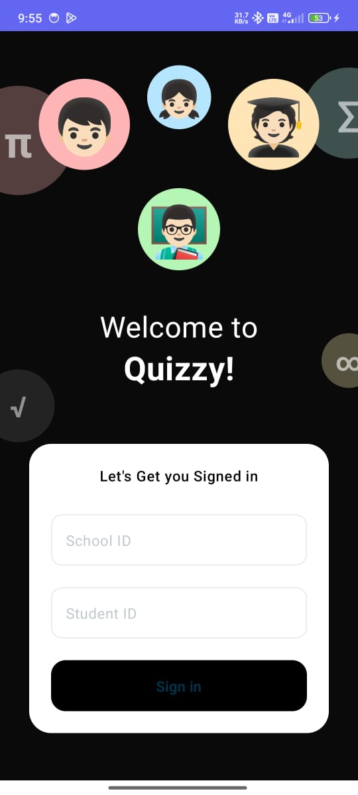
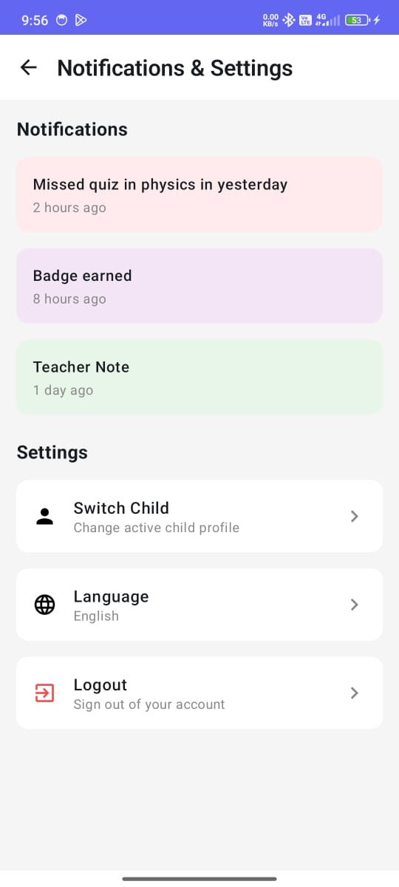
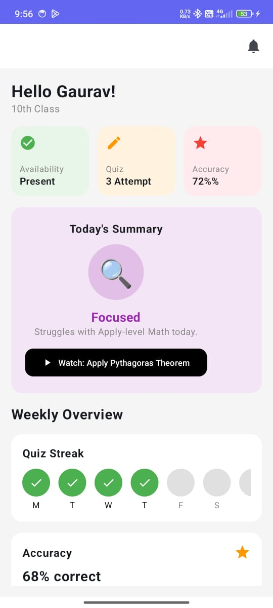
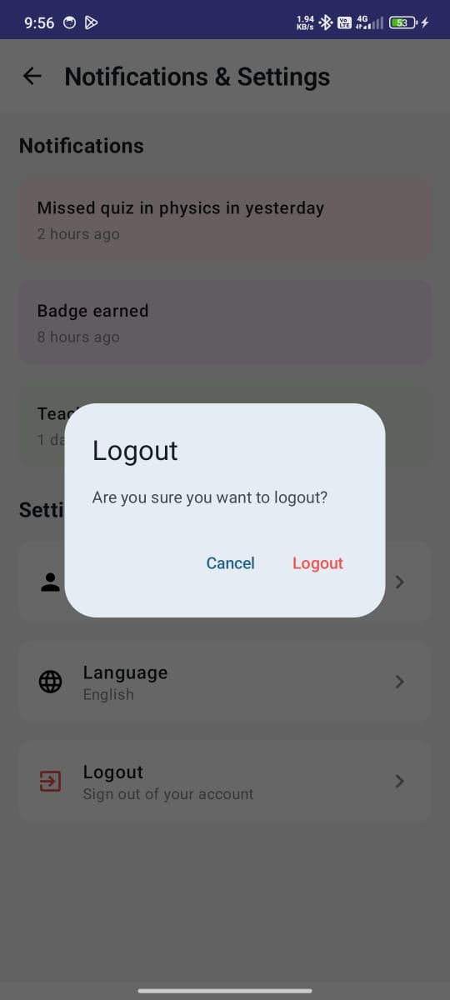
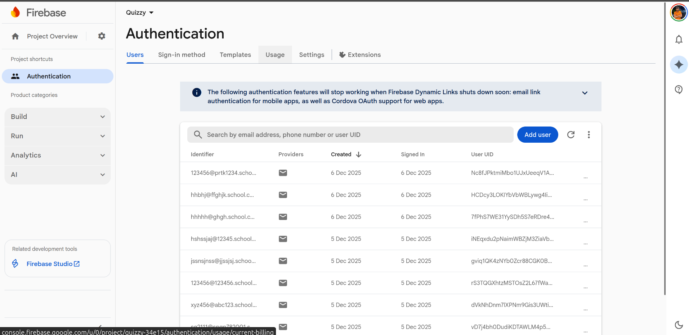

# Quizzy - Android Developer Assignment 

A modern Android quiz application built with **Jetpack Compose** and **MVVM architecture** that demonstrates authentication flow, API integration, and clean architecture principles.

## Screenshots

<table>
  <tr>
    <td></td>
    <td></td>
    <td></td>
    <td></td>
  </tr>
  <tr>
    <td align="center"><b>Login</b></td>
    <td align="center"><b>Home</b></td>
    <td align="center"><b>Settings</b></td>
    <td align="center"><b>Logout</b></td>
  </tr>
</table>

---

###  Firebase Authentication Setup 

<p align="center">
  
</p>

<p align="center"><b>Firebase Auth Dashboard</b></p>


### 1. Authentication
-  **Firebase Authentication**
-  Email/Password authentication flow
-  Automatic login state management
- Successful login navigates to Home screen
- Session persistence across app restarts

###  2. Screens
-  **Login Screen** - Following Figma design with School ID & Student ID inputs
-  **Home Screen** - Displays dashboard data from Mock API
-  **Logout Flow** - Settings screen with logout functionality

###  3. Mock API Integration
-  API URL: `https://firebasestorage.googleapis.com/v0/b/user-contacts-ade83.appspot.com/o/student_dashboard.json?alt=media&token=0091b4c2-2ee2-4326-99cd-96d5312b34bd`
-  Retrofit for network calls
-  Proper error handling
-  Loading states

###  4. Tech Stack
-  **Language**: Kotlin
-  **Architecture**: MVVM
-  **UI**: Jetpack Compose
-  **DI**: Hilt/Dagger
-  **Async**: Coroutines & Flow
-  Clean, readable code with best practices

##  Architecture & Project Structure

### MVVM Architecture Pattern

```
┌─────────────┐
│    View     │  (Composable UI)
│  (Screen)   │
└──────┬──────┘
       │ observes StateFlow
       ↓
┌─────────────┐
│  ViewModel  │  (Business Logic)
│             │
└──────┬──────┘
       │ calls
       ↓
┌─────────────┐
│ Repository  │  (Data Layer)
│             │
└──────┬──────┘
       │ fetches from
       ↓
┌─────────────┐
│ API/Firebase│  (Data Source)
└─────────────┘
```

### Folder Structure

```
com.example.quizzy/
├── 📁 data/
│   ├── 📁 model/              # Data classes
│   │   ├── AuthState.kt
│   │   ├── DashboardResponse.kt
│   │   ├── DashboardUiState.kt
│   │   └── LoginRequest.kt
│   ├── 📁 remote/             # API service
│   │   └── QuizzyApiService.kt
│   └── 📁 repository/         # Repository pattern
│       ├── AuthRepository.kt
│       └── DashboardRepository.kt
├── 📁 di/                     # Dependency Injection
│   └── AppModule.kt
├── 📁 navigation/             # Navigation graph
│   └── QuizzyNavigation.kt
├── 📁 presentation/           # UI Layer
│   ├── 📁 home/
│   │   ├── HomeScreen.kt
│   │   └── HomeViewModel.kt
│   ├── 📁 login/
│   │   ├── LoginScreen.kt
│   │   └── LoginViewModel.kt
│   └── 📁 settings/
│       └── SettingsScreen.kt
├── 📁 ui/theme/               # Theme & styling
│   ├── Color.kt
│   ├── Theme.kt
│   └── Type.kt
├── MainActivity.kt
└── QuizzyApplication.kt
```

## 🚀 Setup Instructions

### Prerequisites
- **Android Studio**: Hedgehog (2023.1.1) or later
- **JDK**: 17
- **Min SDK**: 26 (Android 8.0)
- **Target SDK**: 34 (Android 14)

### Step-by-Step Setup

#### 1. Clone the Repository
```bash
git clone https://github.com/pratish444/PW-Android-Assignment
cd quizzy
```

#### 2. Firebase Configuration

**a. Create Firebase Project:**
1. Go to [Firebase Console](https://console.firebase.google.com/)
2. Click "Add Project"
3. Follow the setup wizard

**b. Add Android App:**
1. In Firebase Console, click "Add App" → Android
2. Enter package name: `com.example.quizzy`
3. Download `google-services.json`
4. Place it in the `app/` directory

**c. Enable Authentication:**
1. Go to Authentication → Sign-in method
2. Enable "Email/Password" authentication
3. Save changes

#### 3. Open Project in Android Studio
```bash
# Open Android Studio
# File → Open → Select the cloned directory
```

#### 4. Sync Gradle
```bash
# Android Studio will prompt to sync
# Or manually: File → Sync Project with Gradle Files
```

#### 5. Build the Project
```bash
./gradlew build
```

#### 6. Run the Application
- Connect an Android device via USB (with USB debugging enabled)
- **OR** Start an Android emulator
- Click the "Run" button (▶️) in Android Studio
- Select your device/emulator

### Login Credentials

The app uses a dynamic authentication system:
- **School ID**: Any alphanumeric string (e.g., `SCHOOL123`)
- **Student ID**: Any alphanumeric string (e.g., `STUDENT456`)
- Password is auto-generated as `Student@123`

**Example Credentials:**
```
School ID: DEMO001
Student ID: STU001
```

### Dependencies

```kotlin
// Core Android
implementation("androidx.core:core-ktx:1.12.0")
implementation("androidx.lifecycle:lifecycle-runtime-ktx:2.6.2")
implementation("androidx.activity:activity-compose:1.8.1")

// Compose
implementation(platform("androidx.compose:compose-bom:2023.10.01"))
implementation("androidx.compose.ui:ui")
implementation("androidx.compose.material3:material3:1.1.2")

// Firebase
implementation(platform("com.google.firebase:firebase-bom:32.6.0"))
implementation("com.google.firebase:firebase-auth-ktx")

// Hilt DI
implementation("com.google.dagger:hilt-android:2.51.1")
ksp("com.google.dagger:hilt-android-compiler:2.51.1")

// Retrofit
implementation("com.squareup.retrofit2:retrofit:2.9.0")
implementation("com.squareup.retrofit2:converter-gson:2.9.0")
```
## 🐛 Troubleshooting

### Common Issues & Solutions

#### Firebase Configuration Error
```
Error: google-services.json not found
```
**Solution**: Download `google-services.json` from Firebase Console and place in `app/` directory


#### API Network Error
```
Error: Unable to resolve host
```
**Solution**:
- Check internet connection
- Verify API URL is accessible
- Check if using emulator with proper network settings
## 📝 APK Download

**Latest Release**: [Download APK](https://drive.google.com/file/d/1brQKb8RX2KlCP4XLTrofrX8rqiNQ26hI/view?usp=sharing)


### Mock API Endpoint
```
GET https://firebasestorage.googleapis.com/v0/b/user-contacts-ade83.appspot.com/o/student_dashboard.json?alt=media&token=0091b4c2-2ee2-4326-99cd-96d5312b34bd
```


